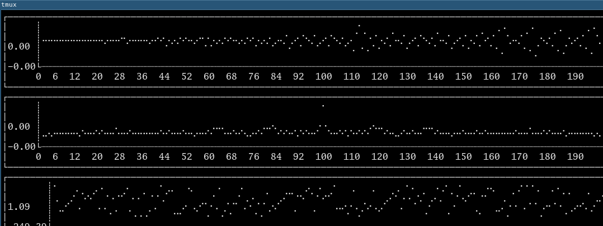

# fftout

```
go get -u github.com/adamryman/fftout
fftoutts
```
### =



This is going to be a learning tool to see a DFT/FFT step by step.

**NOT DONE YET** as I built this in a hacking sessions.

But it is good to share what you are working on.

Run it with `-h` to see the input flags.

Press `q` to exit. I need to figure out how to quit with `Ctrl-C` and `Ctrl-D`

This may move to exporting images rather than using the terminal. It may also
play sounds out the speakers that you input. And it may accept waves files
eventually.
